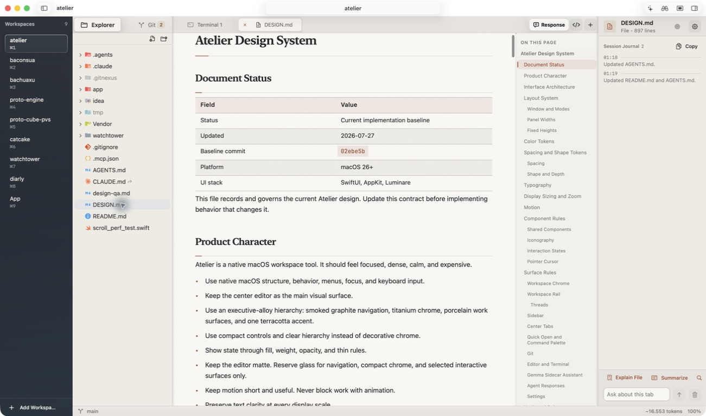

# Atelier

Atelier is a native macOS workspace for editing code, running terminals, reviewing Git changes, and following coding agents.



_The real Atelier app, running the `atelier` workspace on macOS._

## Overview

| Area | What Atelier provides |
|---|---|
| Workspaces | Many live, isolated projects inside one native window |
| Editor | Native editing, syntax highlighting, find and replace, and per-file wrapping |
| Preview | Selectable Markdown documents and interactive local HTML previews |
| Terminal | Persistent multi-tab SwiftTerm sessions with agent-aware shortcuts |
| Git | Status, trees, diffs, staging, branches, commits, and pushes |
| Assistants | Read-only Gemma help, agent threads, response history, and Watchtower plans |
| Diagnostics | Live process, main-thread, workspace, editor, and lifecycle evidence |

Atelier targets macOS 26 and uses Swift 6.2 with strict concurrency. SwiftUI owns composition and state. AppKit owns focus-sensitive native surfaces.

## Product Highlights

### Live Workspaces

- Keep several projects active without rebuilding their sessions.
- Switch projects from the persistent workspace rail.
- Reorder workspaces with drag and drop.
- Use `Command-1` through `Command-9` for saved workspace positions.
- Use `Command-0` to open another workspace.
- Restore workspace order, selected project, file tabs, terminal tabs, and tab selection.
- Keep tabs, terminals, Git state, assistants, palettes, and navigation isolated per workspace.
- Retain security-scoped folder access for each live session.

### Explorer and Editor

- Browse a lazy native file tree with Material Icon Theme icons.
- Keep ignored files visible with reduced emphasis.
- Create, rename, trash, and ignore files from the Explorer.
- Open replaceable previews with one click.
- Promote files into permanent, reorderable tabs.
- Edit through a native AppKit text surface.
- Use syntax highlighting, native find and replace, and per-file word wrap.
- Insert selected line references into the active terminal with `Command-Shift-C`.
- Refresh the Explorer incrementally through bounded file-system watching.

### Markdown and HTML Preview

- Open Markdown and HTML files in Preview mode by default.
- Toggle Source and Preview with `Command-E`.
- Keep preview scroll, selection, outline, and page state across tab switches.
- Render Markdown as one selectable native document with normal `Command-C` behavior.
- Render headings, lists, tasks, quotes, callouts, code, tables, links, images, and footnotes.
- Highlight fenced code and provide visible code-block copy actions.
- Render Mermaid blocks with the bundled local Mermaid runtime.
- Show CSS hex colors as inline swatches.
- Show an "On This Page" outline when the document has enough headings.
- Load local HTML from its file URL with relative assets and scripts enabled.

### Terminals and Agent Threads

- Run several SwiftTerm sessions per workspace.
- Keep inactive terminal processes and scrollback alive.
- Restore terminal tab count and titles after relaunch.
- Start restored terminals as fresh shells at the workspace root.
- Open a normal terminal with `Command-T`.
- Open Claude Code with `Command-Shift-,`.
- Open Codex with `Command-Shift-.`.
- Detect active coding agents from terminal foreground processes.
- Show live and completed agent threads under each workspace.
- Jump from a thread row to its matching terminal.

### Git Workflow

- Read repository identity, current branch, branches, changes, and recent commits.
- Group staged and unstaged changes into expandable directory trees.
- Stage, unstage, stage all, or discard individual changes.
- Open text and image diffs in center tabs.
- Keep Git state fresh after external repository changes.
- Switch branches from the repository controls.
- Generate a Conventional Commit subject through Gemma.
- Run the commit and push pipeline from one visible Push action.
- Keep destructive discard actions behind native confirmation.

### Gemma and Agent Responses

- Use the Gemma workspace tab for read-only repository questions.
- Search workspace text through bounded literal queries.
- Read bounded file ranges, Git diffs, and selected terminal output.
- Keep Gemma unable to edit files or run shell commands.
- Use the right sidecar for context-aware help on the active tab.
- Run Terminal Guardian, Session Journal, Intent Guard, and Pre-commit Whisper.
- Read Claude Code and Codex transcript results in the Response overlay.
- Keep restored responses bounded to the newest 100 results per workspace.
- Read Watchtower plans in a dedicated workspace surface.

Gemma requests use Ollama at `http://localhost:11434/api/chat`. The default model is `gemma4:cloud`.

## Interface

Atelier uses five persistent regions:

```text
Window
|-- Workspace rail
|-- Explorer or Git sidebar
|-- Center tabs
|   |-- Terminal
|   |-- Source file
|   |-- Markdown or HTML preview
|   |-- Git diff
|   `-- Gemma workspace assistant
|-- Gemma context sidecar
`-- Status bar
```

The layout adapts without replacing long-lived native content:

| Width | Sidebar | Sidecar |
|---|---|---|
| Below 900 points | Hidden | Hidden |
| 900 to 1279 points | Visible | Hidden |
| 1280 points or wider | Visible | Visible |

Focus mode hides workspace side panels. It keeps the workspace rail and center surface available.

## Architecture

SwiftUI owns application composition, workspace layout, commands, settings, and observable presentation state. AppKit owns native views, window behavior, focus, cursors, and tracking.

```text
SwiftUI intent -> feature model -> service -> state update -> render
SwiftUI state -> representable -> AppKit controller -> native view
AppKit event -> controller callback -> feature state update
```

Main state owners:

| State | Owner |
|---|---|
| Application lifecycle, ordered workspace catalog, and active selection | `AppModel` |
| Isolated workspace resources and service lifetimes | `WorkspaceSession` |
| Open file, terminal, diff, and Gemma tabs | `TerminalTabsModel` |
| File content, selection, and wrap mode | `EditorSession` |
| Git status and operations | `GitWorkspaceModel` |
| Terminal process and native terminal surface | `TerminalController` |
| Window focus, zoom, and native shortcuts | `WindowController` |
| Context-aware sidecar features | `GemmaSidecarModel` |
| Runtime snapshots, probes, and captures | `RuntimeDiagnosticsService` |

Each `WorkspaceSession` owns its file watcher, Git model, palette, terminals, assistants, and security-scoped access. Closing one workspace stops only that session.

## Persistence Boundaries

| Restored after relaunch | Session-only |
|---|---|
| Workspace order and selected workspace | Navigation history |
| Security-scoped workspace identity | Git presentation state |
| File tab path, order, type, and wrap mode | Git diff tabs |
| Terminal tab count and titles | Gemma tabs and conversations |
| Selected center tab | Palette state |
| Preview or permanent file disposition | Terminal processes and scrollback |

Terminal tabs restore as fresh shells. Missing files and unavailable workspaces do not block valid sessions.

## Keyboard Shortcuts

| Shortcut | Action |
|---|---|
| `Command-O` | Open Folder |
| `Command-T` | New Terminal |
| `Command-Shift-,` | New Claude Code Terminal |
| `Command-Shift-.` | New Codex Terminal |
| `Command-Shift-;` | New Empty Terminal |
| `Command-P` | Quick Open |
| `Command-Shift-P` | Command Palette |
| `Command-F` | Find in active source file |
| `Command-Option-F` | Find and replace |
| `Command-G` | Next search result |
| `Command-Shift-G` | Previous search result |
| `Command-E` | Toggle Source and Preview |
| `Command-Shift-C` | Send selected line reference to terminal |
| `Command-W` | Close active closable tab |
| `Control--` | Back |
| `Control-Shift--` | Forward |
| `Command-Shift-E` | Toggle left panel |
| `Command-Shift-R` | Toggle right panel |
| `Command-+` | Zoom in |
| `Command--` | Zoom out |
| `Command-0` | Open a new workspace |
| `Command-1` through `Command-9` | Select workspace by rail position |
| `Command-Shift-F` | Toggle Focus Mode |
| ``Command-` `` | Select next workspace |
| `Option-Z` | Toggle word wrap |

Menus, toolbar controls, and the Command Palette call the same typed actions.

## Requirements

### Required

- macOS 26 or newer.
- Xcode with the Swift 6.2 toolchain.
- Git.
- SwiftLint for the packaging script.

Install SwiftLint with Homebrew:

```bash
brew install swiftlint
```

### Optional

- An Apple signing identity for stable installed-app folder permissions.
- Ollama running locally for Gemma and generated commit subjects.
- Access to the default `gemma4:cloud` model through Ollama.
- Claude Code or Codex transcripts for the Response overlay.

## Build and Test

Run commands from the repository root:

```bash
swift build --package-path app/Atelier
swift test --package-path app/Atelier
app/Atelier/.build/debug/Atelier --selftest
```

The test target covers models, parsers, persistence, services, diagnostics, and feature policies. The self-test checks packaged persistence, file loading, Git parsing, Git operations, and file saving.

## Run and Package

```bash
app/Atelier/scripts/build_and_run.sh run
app/Atelier/scripts/build_and_run.sh --verify
app/Atelier/scripts/build_and_run.sh --release
```

| Command | Result |
|---|---|
| `run` | Build, sign, install to `/Applications`, and launch |
| `--verify` | Install, launch, and confirm the process starts |
| `--release` | Create `app/Atelier/dist/Atelier.app` |

The script signs with an available Apple identity. It falls back to ad hoc signing when needed.

## Runtime Diagnostics

Atelier ships a terminal-first Runtime Probe. It records bounded metrics without file content, terminal output, prompts, diffs, or credentials.

```bash
app/Atelier/scripts/atelier-doctor status --json
app/Atelier/scripts/atelier-doctor watch --interval 1
app/Atelier/scripts/atelier-doctor probe main
app/Atelier/scripts/atelier-doctor probe editor
app/Atelier/scripts/atelier-doctor probe editor-scroll --delta 400 --restore
app/Atelier/scripts/atelier-doctor capture --seconds 3
```

`status` reports process, heartbeat, workspace, editor, diagnostics, and verdict data. `capture` collects a snapshot, flight recorder, process sample, logs, memory summary, and crash-report index.

## Dependencies

| Package | Version | Role |
|---|---:|---|
| SwiftTerm | 1.15.0 | Native terminal sessions |
| HighlightSwift | 1.1.0 | Syntax highlighting |
| KeyboardShortcuts | 3.0.1 | User-configurable shortcuts |
| Pow | 1.0.5 | Small SwiftUI effects |
| Luminare | Local pinned package | Native macOS controls and styling |

Atelier also bundles Mermaid, Material Icon Theme assets, and JetBrains Mono. Their license files ship with the related resources.

## Project Structure

```text
app/Atelier/
|-- Package.swift
|-- Packaging/
|-- Resources/
|-- Sources/Atelier/
|   |-- Agent/
|   |-- App/
|   |-- Commands/
|   |-- Editor/
|   |-- FileTree/
|   |-- Git/
|   |-- Platform/
|   |-- Settings/
|   |-- Shared/
|   |-- Terminal/
|   |-- Theme/
|   |-- Watchtower/
|   `-- Workspace/
|-- Tests/AtelierTests/
`-- scripts/

Vendor/Luminare/
```

Generated `.build/` and `dist/` directories remain untracked.

## Development Contract

- Read [`DESIGN.md`](DESIGN.md) before changing product behavior.
- Follow [`AGENTS.md`](AGENTS.md) for repository workflow and verification rules.
- Keep generated build products outside Git.
- Preserve native editor, terminal, and preview surfaces across tab switches.
- Run build, tests, self-test, and the installed app for Swift changes.
